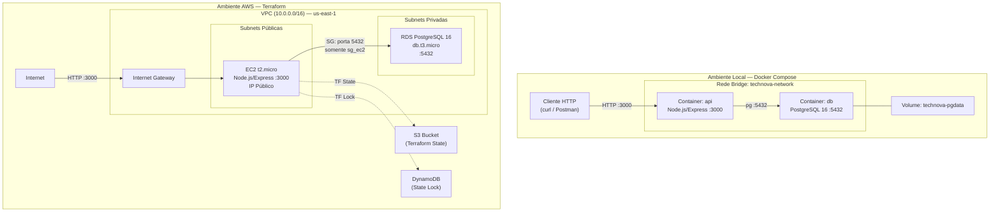
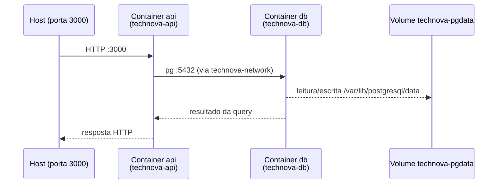
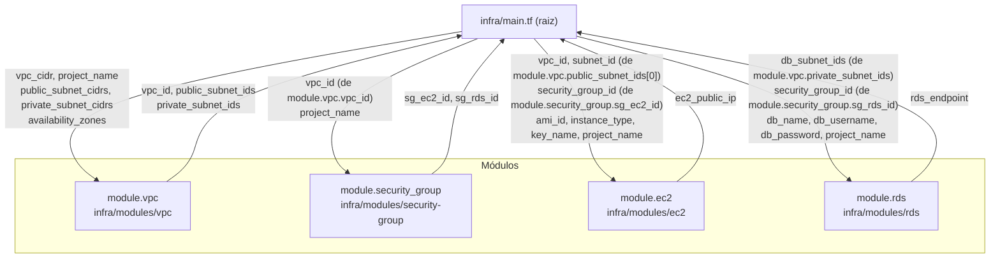
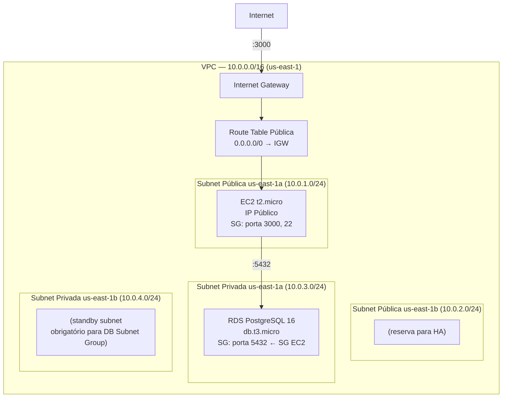
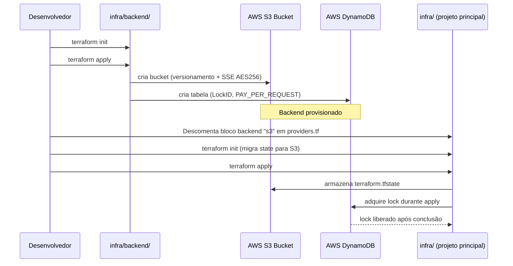
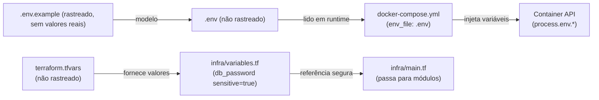
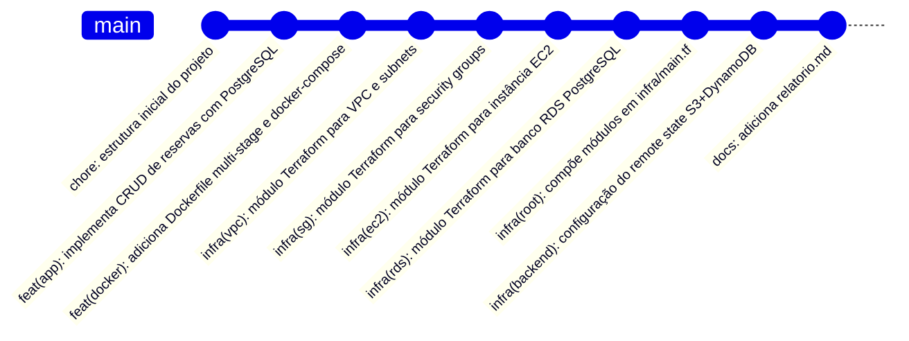

# Design Document — API de Reservas TechNova

## Overview

A **API de Reservas TechNova** é uma API REST em Node.js/Express com persistência em PostgreSQL, containerizada via Docker/Docker Compose e com infraestrutura provisionada na AWS usando Terraform modularizado. Este documento de design detalha as decisões técnicas, estruturas de código, contratos de API, arquitetura de infraestrutura e estratégia de testes que orientam a implementação.

---

## Architecture

O projeto opera em dois ambientes distintos: **local** (Docker Compose) e **AWS** (Terraform).



**Decisões de arquitetura:**
- A API não tem estado (stateless): todo estado está no PostgreSQL.
- O container da API aguarda o healthcheck do `db` antes de iniciar (evita falha na conexão inicial).
- Na AWS, o RDS fica em subnets privadas — sem IP público, acessível somente via SG da EC2.
- O Remote State garante que execuções concorrentes do Terraform não corrompam o state.

---

## Components and Interfaces

### 2.1 Estrutura de Arquivos

```
app/
├── Dockerfile
├── .dockerignore
├── package.json
└── src/
    ├── index.js                  # Entry point: carrega dotenv, valida envs, inicia servidor
    ├── db/
    │   └── index.js              # Pool pg, função de health check de conexão
    ├── routes/
    │   └── reservas.js           # Definição de rotas Express
    ├── controllers/
    │   └── reservasController.js # Lógica de negócio + chamadas ao pool
    └── validators/
        └── reserva.js            # Helpers de validação de campos
```

### 2.2 Entry Point — `src/index.js`

```js
// src/index.js
require('dotenv').config(); // DEVE ser a primeira linha antes de qualquer require de db

const { validateEnvVars } = require('./validators/reserva');
const { checkDbConnection }  = require('./db');
const express = require('express');
const reservasRoutes = require('./routes/reservas');

// 1. Validar variáveis de ambiente obrigatórias antes de qualquer coisa
validateEnvVars(['DB_HOST', 'DB_PORT', 'DB_USER', 'DB_PASSWORD', 'DB_NAME']);

const app = express();
app.use(express.json());

// 2. Rotas
app.use('/reservas', reservasRoutes);

// 3. Health check
app.get('/health', async (req, res) => {
  try {
    await checkDbConnection();
    res.status(200).json({ status: 'ok', timestamp: new Date().toISOString() });
  } catch (err) {
    res.status(503).json({ status: 'error', mensagem: 'Database não está acessível' });
  }
});

// 4. Inicialização: testar conexão antes de aceitar requisições
const PORT = process.env.PORT || 3000;

async function start() {
  try {
    await checkDbConnection(10_000); // timeout 10s
    app.listen(PORT, () => console.log(`API rodando na porta ${PORT}`));
  } catch (err) {
    console.error('Falha ao conectar ao banco na inicialização:', err.message, err.code);
    process.exit(1);
  }
}

start();
```

**Decisão:** `dotenv.config()` na primeira linha garante que `process.env.*` esteja preenchido antes que qualquer módulo que importe `db/index.js` seja avaliado.

### 2.3 Pool de Conexão — `src/db/index.js`

```js
// src/db/index.js
const { Pool } = require('pg');

const pool = new Pool({
  host:     process.env.DB_HOST,
  port:     parseInt(process.env.DB_PORT, 10),
  user:     process.env.DB_USER,
  password: process.env.DB_PASSWORD,
  database: process.env.DB_NAME,
});

/**
 * Testa a conectividade com o banco.
 * @param {number} timeoutMs - timeout em milissegundos (default 10000)
 */
async function checkDbConnection(timeoutMs = 10_000) {
  const client = await Promise.race([
    pool.connect(),
    new Promise((_, reject) =>
      setTimeout(() => reject(new Error('DB connection timeout')), timeoutMs)
    ),
  ]);
  client.release();
}

module.exports = { pool, checkDbConnection };
```

### 2.4 Helpers de Validação — `src/validators/reserva.js`

```js
// src/validators/reserva.js

const STATUS_VALIDOS = ['pendente', 'confirmada', 'cancelada'];
const DATE_REGEX = /^\d{4}-\d{2}-\d{2}$/;

function isClienteValido(cliente) {
  return typeof cliente === 'string' && cliente.trim().length > 0 && cliente.length <= 255;
}

function isDataValida(data) {
  if (typeof data !== 'string' || !DATE_REGEX.test(data)) return false;
  const d = new Date(data);
  return !isNaN(d.getTime());
}

function isStatusValido(status) {
  return STATUS_VALIDOS.includes(status);
}

function isIdValido(id) {
  const n = Number(id);
  return Number.isInteger(n) && n > 0;
}

/**
 * Valida variáveis de ambiente obrigatórias.
 * Encerra o processo se alguma estiver ausente.
 */
function validateEnvVars(keys) {
  const missing = keys.filter(k => !process.env[k]);
  if (missing.length > 0) {
    console.error(`Variáveis de ambiente obrigatórias ausentes: ${missing.join(', ')}`);
    process.exit(1);
  }
}

module.exports = { isClienteValido, isDataValida, isStatusValido, isIdValido, validateEnvVars, STATUS_VALIDOS };
```

### 2.5 Padrão de Resposta de Erro

Todos os erros retornam JSON no formato:

```json
{ "erro": "<mensagem descritiva>" }
```

Exemplos:
- `400`: `{ "erro": "O campo 'cliente' é obrigatório e não pode estar vazio." }`
- `404`: `{ "erro": "Reserva não encontrada." }`
- `503`: `{ "erro": "Serviço de banco de dados indisponível." }`

---

## Data Models

### 3.1 DDL — Tabela `reservas`

```sql
CREATE TABLE IF NOT EXISTS reservas (
    id      SERIAL PRIMARY KEY,
    cliente VARCHAR(255) NOT NULL,
    data    DATE         NOT NULL,
    status  VARCHAR(50)  NOT NULL
        CHECK (status IN ('pendente', 'confirmada', 'cancelada'))
);
```

A tabela é criada automaticamente na inicialização da API se não existir. A constraint `CHECK` garante integridade no nível do banco — a API também valida antes de qualquer query, de forma que o banco seja uma segunda linha de defesa.

### 3.2 Mapeamento JavaScript ↔ SQL

| Campo JS   | Tipo JS        | Coluna SQL | Tipo SQL      | Observação                                    |
|------------|----------------|------------|---------------|-----------------------------------------------|
| `id`       | `number`       | `id`       | `SERIAL`      | Gerado pelo banco, nunca enviado no POST       |
| `cliente`  | `string`       | `cliente`  | `VARCHAR(255)`| Não vazio, máximo 255 caracteres               |
| `data`     | `string`       | `data`     | `DATE`        | Sempre serializada como `YYYY-MM-DD` (ver nota)|
| `status`   | `string`       | `status`   | `VARCHAR(50)` | Enum: `pendente`, `confirmada`, `cancelada`    |

**Nota sobre serialização de `data`:** O driver `pg` retorna campos `DATE` do PostgreSQL como objetos `Date` JavaScript. Para garantir que o JSON retornado pela API sempre use o formato `YYYY-MM-DD` (e não o timezone local do servidor), as queries devem usar `TO_CHAR(data, 'YYYY-MM-DD') AS data` ou o campo deve ser serializado explicitamente no controller:

```js
// No controller, ao retornar reservas:
function formatReserva(row) {
  return {
    id: row.id,
    cliente: row.cliente,
    data: row.data instanceof Date
      ? row.data.toISOString().slice(0, 10)
      : row.data,
    status: row.status,
  };
}
```

---

## API Contract

### 4.1 Tabela de Endpoints

| Método   | Rota              | Descrição                        | Sucesso | Erros possíveis     |
|----------|-------------------|----------------------------------|---------|---------------------|
| `POST`   | `/reservas`       | Criar nova reserva               | 201     | 400, 503            |
| `GET`    | `/reservas`       | Listar todas as reservas         | 200     | 503                 |
| `GET`    | `/reservas/:id`   | Buscar reserva por ID            | 200     | 400, 404, 503       |
| `PUT`    | `/reservas/:id`   | Atualizar reserva por ID         | 200     | 400, 404, 503       |
| `DELETE` | `/reservas/:id`   | Excluir reserva por ID           | 200     | 400, 404, 503       |
| `GET`    | `/health`         | Health check da API              | 200     | 503                 |

### 4.2 POST /reservas

**Request:**
```json
{
  "cliente": "João Silva",
  "data": "2025-08-15",
  "status": "pendente"
}
```

**Respostas:**

| Status | Corpo                                                   | Condição                             |
|--------|---------------------------------------------------------|--------------------------------------|
| 201    | `{ "id": 1, "cliente": "...", "data": "...", "status": "..." }` | Campos válidos, DB disponível        |
| 400    | `{ "erro": "O campo 'cliente' é obrigatório..." }`      | `cliente` ausente ou vazio           |
| 400    | `{ "erro": "O campo 'cliente' excede 255 caracteres." }` | `cliente` > 255 chars               |
| 400    | `{ "erro": "O campo 'data' é obrigatório..." }`         | `data` ausente ou formato inválido   |
| 400    | `{ "erro": "O campo 'status' deve ser um de: pendente, confirmada, cancelada." }` | `status` inválido |
| 503    | `{ "erro": "Serviço de banco de dados indisponível." }` | DB inacessível                       |

### 4.3 GET /reservas

**Respostas:**

| Status | Corpo                                        | Condição                  |
|--------|----------------------------------------------|---------------------------|
| 200    | `[{ "id": 1, "cliente": "...", ... }, ...]`   | DB disponível (com dados) |
| 200    | `[]`                                         | DB disponível, sem dados  |
| 503    | `{ "erro": "Serviço de banco de dados indisponível." }` | DB inacessível |

### 4.4 GET /reservas/:id

**Parâmetro:** `:id` deve ser inteiro positivo.

**Respostas:**

| Status | Corpo                                                   | Condição                        |
|--------|---------------------------------------------------------|---------------------------------|
| 200    | `{ "id": 1, "cliente": "...", "data": "...", "status": "..." }` | id existe             |
| 400    | `{ "erro": "O campo 'id' deve ser um inteiro positivo." }` | id não é inteiro positivo    |
| 404    | `{ "erro": "Reserva não encontrada." }`                 | id não existe no banco          |
| 503    | `{ "erro": "Serviço de banco de dados indisponível." }` | DB inacessível                  |

### 4.5 PUT /reservas/:id

**Request:** Pelo menos um campo dentre `cliente`, `data`, `status`.
```json
{
  "status": "confirmada"
}
```

**Respostas:**

| Status | Corpo                                                             | Condição                              |
|--------|-------------------------------------------------------------------|---------------------------------------|
| 200    | `{ "id": 1, "cliente": "...", "data": "...", "status": "confirmada" }` | Atualização bem-sucedida        |
| 400    | `{ "erro": "Forneça ao menos um campo: cliente, data ou status." }` | Corpo sem campos atualizáveis       |
| 400    | `{ "erro": "O campo 'id' deve ser um inteiro positivo." }`        | id não é inteiro positivo             |
| 400    | `{ "erro": "O campo 'data' deve seguir o formato YYYY-MM-DD." }`  | `data` presente mas inválida          |
| 400    | `{ "erro": "O campo 'status' deve ser um de: ..." }`              | `status` presente mas inválido        |
| 404    | `{ "erro": "Reserva não encontrada." }`                           | id não existe                         |
| 503    | `{ "erro": "Serviço de banco de dados indisponível." }`           | DB inacessível                        |

**Decisão de design:** O PUT aceita atualização parcial (somente os campos enviados são atualizados). A query SQL é construída dinamicamente com apenas os campos presentes no body.

```js
// Exemplo de query dinâmica no controller
const campos = [];
const valores = [];
let i = 1;
if (cliente !== undefined) { campos.push(`cliente = $${i++}`); valores.push(cliente); }
if (data    !== undefined) { campos.push(`data = $${i++}`);    valores.push(data); }
if (status  !== undefined) { campos.push(`status = $${i++}`);  valores.push(status); }
valores.push(id);
const query = `UPDATE reservas SET ${campos.join(', ')} WHERE id = $${i} RETURNING *`;
```

### 4.6 DELETE /reservas/:id

**Respostas:**

| Status | Corpo                                                    | Condição                        |
|--------|----------------------------------------------------------|---------------------------------|
| 200    | `{ "mensagem": "Reserva excluída com sucesso." }`        | id existe e foi removido        |
| 400    | `{ "erro": "O campo 'id' deve ser um inteiro positivo." }` | id não é inteiro positivo     |
| 404    | `{ "erro": "Reserva não encontrada." }`                  | id não existe no banco          |
| 503    | `{ "erro": "Serviço de banco de dados indisponível." }`  | DB inacessível                  |

### 4.7 GET /health

**Respostas:**

| Status | Corpo                                                       | Condição         |
|--------|-------------------------------------------------------------|------------------|
| 200    | `{ "status": "ok", "timestamp": "2025-08-15T10:30:00.000Z" }` | DB disponível   |
| 503    | `{ "status": "error", "mensagem": "Database não está acessível" }` | DB indisponível |

---

## Docker Architecture

### 5.1 Dockerfile Multi-Estágio — `app/Dockerfile`

```dockerfile
# ─── Estágio 1: instalação de dependências ────────────────────────────────────
FROM node:20-alpine AS deps

WORKDIR /app

# Copiar apenas os arquivos de dependências para aproveitar cache de layer
COPY package*.json ./

# Instalar somente dependências de produção
RUN npm ci --only=production

# ─── Estágio 2: imagem de execução ────────────────────────────────────────────
FROM node:20-alpine AS runner

WORKDIR /app

# Copiar dependências instaladas no estágio anterior
COPY --from=deps /app/node_modules ./node_modules

# Copiar código-fonte
COPY src/ ./src/
COPY package.json ./

# Usar usuário não-root (UID 1000) por segurança
USER node

EXPOSE 3000

CMD ["node", "src/index.js"]
```

**Decisões:**
- `node:20-alpine` minimiza tamanho da imagem e superfície de ataque.
- Dois estágios: `deps` aproveita cache de layer para `node_modules`; `runner` não contém ferramentas de build.
- `USER node` (UID 1000): atende ao requisito de não executar como root.
- `npm ci --only=production`: exclui devDependencies da imagem final.

### 5.2 `.dockerignore` — `app/.dockerignore`

```
node_modules/
.env
*.log
.git/
```

### 5.3 Docker Compose — `docker-compose.yml` (raiz do projeto)

```yaml
version: "3.9"

services:
  db:
    image: postgres:16-alpine
    container_name: technova-db
    environment:
      POSTGRES_DB:       ${DB_NAME}
      POSTGRES_USER:     ${DB_USER}
      POSTGRES_PASSWORD: ${DB_PASSWORD}
    volumes:
      - technova-pgdata:/var/lib/postgresql/data
    networks:
      - technova-network
    healthcheck:
      test: ["CMD-SHELL", "pg_isready -U ${DB_USER} -d ${DB_NAME}"]
      interval: 10s
      timeout:  5s
      retries:  5

  api:
    build:
      context: ./app
      dockerfile: Dockerfile
    container_name: technova-api
    ports:
      - "3000:3000"
    env_file:
      - .env
    networks:
      - technova-network
    depends_on:
      db:
        condition: service_healthy

networks:
  technova-network:
    driver: bridge

volumes:
  technova-pgdata:
```

**Decisões:**
- `condition: service_healthy` garante que a API só sobe após o PostgreSQL estar pronto para conexões.
- `env_file: .env` centraliza todas as variáveis; o arquivo `.env` não é rastreado pelo Git.
- Volume nomeado `technova-pgdata` persiste dados entre `docker compose down` / `up`.
- Rede `technova-network` isola a comunicação: a porta 5432 não é exposta ao host.

### 5.4 Diagrama de Comunicação Docker Compose



### 5.5 Arquivo `.env.example`

```dotenv
# Configurações do banco de dados
DB_HOST=db
DB_PORT=5432
DB_USER=technova
DB_PASSWORD=example_password
DB_NAME=technova_db

# Porta da API
PORT=3000
```

---

## Terraform Module Architecture

### 6.1 Diagrama de Dependências entre Módulos



**Nota importante:** O `module.security_group` recebe somente `vpc_id` e `project_name`. Ele cria **internamente** tanto o SG da EC2 quanto o SG do RDS — a regra de ingress 5432 referencia `aws_security_group.ec2.id` diretamente dentro do módulo, sem precisar receber o `sg_ec2_id` como variável de entrada.

### 6.2 Interfaces dos Módulos

#### `infra/modules/vpc`

| Variável de Entrada        | Tipo           | Obrigatória | Descrição                                      |
|----------------------------|----------------|-------------|------------------------------------------------|
| `vpc_cidr`                 | `string`       | Sim         | CIDR da VPC (ex: `10.0.0.0/16`)               |
| `project_name`             | `string`       | Sim         | Nome do projeto para tags                      |
| `public_subnet_cidrs`      | `list(string)` | Sim         | CIDRs das subnets públicas (mín. 2)            |
| `private_subnet_cidrs`     | `list(string)` | Sim         | CIDRs das subnets privadas (mín. 2)            |
| `availability_zones`       | `list(string)` | Sim         | AZs (ex: `["us-east-1a", "us-east-1b"]`)       |

| Output                | Tipo           | Descrição                                |
|-----------------------|----------------|------------------------------------------|
| `vpc_id`              | `string`       | ID da VPC criada                         |
| `public_subnet_ids`   | `list(string)` | IDs das subnets públicas                 |
| `private_subnet_ids`  | `list(string)` | IDs das subnets privadas                 |

#### `infra/modules/security-group`

| Variável de Entrada | Tipo     | Obrigatória | Descrição                          |
|---------------------|----------|-------------|------------------------------------|
| `vpc_id`            | `string` | Sim         | ID da VPC onde criar os SGs        |
| `project_name`      | `string` | Sim         | Nome do projeto para tags e nomes  |

| Output       | Tipo     | Descrição                           |
|--------------|----------|-------------------------------------|
| `sg_ec2_id`  | `string` | ID do Security Group da EC2         |
| `sg_rds_id`  | `string` | ID do Security Group do RDS         |

**Recursos criados internamente pelo módulo:**
- `aws_security_group.ec2`: ingress 3000/TCP e 22/TCP de `0.0.0.0/0`; egress all.
- `aws_security_group.rds`: ingress 5432/TCP somente de `aws_security_group.ec2.id`; egress all.

#### `infra/modules/ec2`

| Variável de Entrada  | Tipo     | Obrigatória | Padrão     | Descrição                                |
|----------------------|----------|-------------|------------|------------------------------------------|
| `vpc_id`             | `string` | Sim         | —          | ID da VPC                                |
| `subnet_id`          | `string` | Sim         | —          | ID da subnet pública                     |
| `security_group_id`  | `string` | Sim         | —          | ID do SG da EC2                          |
| `ami_id`             | `string` | Sim         | —          | ID da AMI Amazon Linux 2                 |
| `instance_type`      | `string` | Não         | `t2.micro` | Tipo da instância                        |
| `key_name`           | `string` | Sim         | —          | Nome do key pair para SSH                |
| `project_name`       | `string` | Sim         | —          | Nome do projeto para tags                |

| Output           | Tipo     | Descrição                       |
|------------------|----------|---------------------------------|
| `ec2_public_ip`  | `string` | IP público da instância EC2     |

#### `infra/modules/rds`

| Variável de Entrada  | Tipo           | Obrigatória | Descrição                           |
|----------------------|----------------|-------------|-------------------------------------|
| `db_subnet_ids`      | `list(string)` | Sim         | IDs das subnets privadas para o RDS |
| `security_group_id`  | `string`       | Sim         | ID do SG do RDS                     |
| `db_name`            | `string`       | Sim         | Nome do banco de dados              |
| `db_username`        | `string`       | Sim         | Usuário administrador do RDS        |
| `db_password`        | `string`       | Sim         | Senha do RDS (sensitive)            |
| `project_name`       | `string`       | Sim         | Nome do projeto para tags           |

| Output          | Tipo     | Descrição                               |
|-----------------|----------|-----------------------------------------|
| `rds_endpoint`  | `string` | Endpoint de conexão do RDS PostgreSQL   |

### 6.3 Snippet HCL — `infra/main.tf`

```hcl
module "vpc" {
  source = "./modules/vpc"

  vpc_cidr              = var.vpc_cidr
  project_name          = var.project_name
  public_subnet_cidrs   = ["10.0.1.0/24", "10.0.2.0/24"]
  private_subnet_cidrs  = ["10.0.3.0/24", "10.0.4.0/24"]
  availability_zones    = ["us-east-1a", "us-east-1b"]
}

module "security_group" {
  source = "./modules/security-group"

  # O módulo cria internamente SG da EC2 e SG do RDS
  vpc_id       = module.vpc.vpc_id
  project_name = var.project_name
}

module "ec2" {
  source = "./modules/ec2"

  vpc_id            = module.vpc.vpc_id
  subnet_id         = module.vpc.public_subnet_ids[0]
  security_group_id = module.security_group.sg_ec2_id  # output do módulo SG
  ami_id            = var.ami_id
  instance_type     = "t2.micro"
  key_name          = var.key_name
  project_name      = var.project_name
}

module "rds" {
  source = "./modules/rds"

  db_subnet_ids     = module.vpc.private_subnet_ids
  security_group_id = module.security_group.sg_rds_id  # output do módulo SG
  db_name           = var.project_name
  db_username       = var.db_username
  db_password       = var.db_password
  project_name      = var.project_name
}
```

### 6.4 Snippet HCL — `infra/modules/security-group/main.tf`

```hcl
resource "aws_security_group" "ec2" {
  name        = "${var.project_name}-sg-ec2"
  description = "Security Group para EC2 — API TechNova"
  vpc_id      = var.vpc_id

  ingress {
    description = "API port"
    from_port   = 3000
    to_port     = 3000
    protocol    = "tcp"
    cidr_blocks = ["0.0.0.0/0"]
  }

  ingress {
    description = "SSH"
    from_port   = 22
    to_port     = 22
    protocol    = "tcp"
    cidr_blocks = ["0.0.0.0/0"]
  }

  egress {
    from_port   = 0
    to_port     = 0
    protocol    = "-1"
    cidr_blocks = ["0.0.0.0/0"]
  }

  tags = {
    Name    = "${var.project_name}-sg-ec2"
    Project = var.project_name
  }
}

resource "aws_security_group" "rds" {
  name        = "${var.project_name}-sg-rds"
  description = "Security Group para RDS PostgreSQL — API TechNova"
  vpc_id      = var.vpc_id

  ingress {
    description              = "PostgreSQL somente da EC2"
    from_port                = 5432
    to_port                  = 5432
    protocol                 = "tcp"
    # Referência direta ao SG da EC2, criado no mesmo módulo
    source_security_group_id = aws_security_group.ec2.id
  }

  egress {
    from_port   = 0
    to_port     = 0
    protocol    = "-1"
    cidr_blocks = ["0.0.0.0/0"]
  }

  tags = {
    Name    = "${var.project_name}-sg-rds"
    Project = var.project_name
  }
}
```

---

## AWS Infrastructure Architecture

### 7.1 Layout VPC



### 7.2 CIDRs Sugeridos

| Recurso                       | CIDR / Valor          |
|-------------------------------|-----------------------|
| VPC                           | `10.0.0.0/16`         |
| Subnet Pública us-east-1a     | `10.0.1.0/24`         |
| Subnet Pública us-east-1b     | `10.0.2.0/24`         |
| Subnet Privada us-east-1a     | `10.0.3.0/24`         |
| Subnet Privada us-east-1b     | `10.0.4.0/24`         |

### 7.3 Tabelas de Security Groups

**SG da EC2 (`<project>-sg-ec2`)**

| Direção | Protocolo | Porta | Origem/Destino | Descrição               |
|---------|-----------|-------|----------------|-------------------------|
| Ingress | TCP       | 3000  | `0.0.0.0/0`    | API REST pública        |
| Ingress | TCP       | 22    | `0.0.0.0/0`    | SSH de administração    |
| Egress  | All       | All   | `0.0.0.0/0`    | Todo tráfego de saída   |

**SG do RDS (`<project>-sg-rds`)**

| Direção | Protocolo | Porta | Origem/Destino       | Descrição                     |
|---------|-----------|-------|----------------------|-------------------------------|
| Ingress | TCP       | 5432  | `sg_ec2_id` (SG EC2) | PostgreSQL somente da EC2     |
| Egress  | All       | All   | `0.0.0.0/0`          | Todo tráfego de saída         |

---

## Remote State Architecture

### 8.1 Fluxo de Provisionamento (Remote Backend antes do Projeto Principal)



### 8.2 Snippet HCL — `infra/backend/main.tf`

```hcl
provider "aws" {
  region = "us-east-1"
}

resource "aws_s3_bucket" "tf_state" {
  bucket = "technova-tf-state-${random_id.suffix.hex}"

  tags = {
    Name    = "technova-terraform-state"
    Project = "technova"
  }
}

resource "random_id" "suffix" {
  byte_length = 4
}

resource "aws_s3_bucket_versioning" "tf_state" {
  bucket = aws_s3_bucket.tf_state.id

  versioning_configuration {
    status = "Enabled"
  }
}

resource "aws_s3_bucket_server_side_encryption_configuration" "tf_state" {
  bucket = aws_s3_bucket.tf_state.id

  rule {
    apply_server_side_encryption_by_default {
      sse_algorithm = "AES256"
    }
  }
}

resource "aws_dynamodb_table" "tf_lock" {
  name         = "technova-tf-lock"
  billing_mode = "PAY_PER_REQUEST"
  hash_key     = "LockID"

  attribute {
    name = "LockID"
    type = "S"
  }

  tags = {
    Name    = "technova-terraform-lock"
    Project = "technova"
  }
}

output "bucket_name" {
  value = aws_s3_bucket.tf_state.bucket
}

output "dynamodb_table_name" {
  value = aws_dynamodb_table.tf_lock.name
}
```

### 8.3 Bloco Backend S3 (comentado) — `infra/providers.tf`

```hcl
terraform {
  # Descomente APÓS provisionar infra/backend/ e substitua <BUCKET_NAME> pelo valor do output
  # backend "s3" {
  #   bucket         = "<BUCKET_NAME>"
  #   key            = "technova/terraform.tfstate"
  #   region         = "us-east-1"
  #   dynamodb_table = "technova-tf-lock"
  #   encrypt        = true
  # }

  required_providers {
    aws = {
      source  = "hashicorp/aws"
      version = "~> 5.0"
    }
  }
}

provider "aws" {
  region = var.aws_region
}
```

---

## Security Design

### 9.1 Fluxo de Variáveis Sensíveis



### 9.2 Checklist de Segurança

| Item                                                                 | Verificação                                                              |
|----------------------------------------------------------------------|--------------------------------------------------------------------------|
| Sem senhas hardcoded em arquivos `.js`                               | Todas as configs via `process.env.*`                                     |
| Sem senhas hardcoded em arquivos `.tf`                               | `db_password` como variável `sensitive = true`                           |
| `.env` não rastreado pelo Git                                        | `.gitignore` inclui `.env`                                               |
| `*.tfstate` e `*.tfstate.*` não rastreados                           | `.gitignore` inclui `*.tfstate`, `*.tfstate.*`                           |
| `.terraform/` não rastreada                                          | `.gitignore` inclui `.terraform/`                                        |
| `*.pem` não rastreado                                                | `.gitignore` inclui `*.pem`                                              |
| `terraform.tfvars` não rastreado                                     | Adicionar `terraform.tfvars` ao `.gitignore`                             |
| Container não executa como root                                      | `USER node` no Dockerfile (UID 1000)                                     |
| `node_modules/` fora da imagem Docker (copiada do estágio deps)      | `.dockerignore` inclui `node_modules/`                                   |
| Sem recursos IAM criados pelo Terraform                              | Nenhum `aws_iam_user`, `aws_iam_group`, `aws_iam_role` nos módulos       |
| Somente `LabInstanceProfile` referenciado como profile da EC2        | `iam_instance_profile = "LabInstanceProfile"` hardcoded no módulo ec2    |
| RDS sem IP público                                                   | `publicly_accessible = false` no módulo rds                              |
| RDS com criptografia em repouso                                      | `storage_encrypted = true` no módulo rds                                 |
| Porta 5432 do RDS acessível somente pela EC2                         | SG do RDS usa `source_security_group_id = aws_security_group.ec2.id`     |

---

## Correctness Properties

*Uma propriedade é uma característica ou comportamento que deve ser verdadeiro em todas as execuções válidas de um sistema — essencialmente, uma afirmação formal sobre o que o sistema deve fazer. As propriedades servem como ponte entre especificações legíveis por humanos e garantias de corretude verificáveis por máquina.*

A biblioteca de property-based testing escolhida é **[fast-check](https://fast-check.dev/)** para Node.js. Cada teste deve ser configurado com no mínimo 100 iterações (`numRuns: 100`).

**Tag format:** `Feature: api-reservas-technova, Property {N}: {título}`

---

### Property 1: Round-trip de criação e busca por ID

*Para qualquer* combinação válida de `(cliente, data, status)`, ao criar uma reserva via POST `/reservas` (com resposta 201), buscar essa reserva via GET `/reservas/:id` deve retornar um objeto com os campos `cliente`, `data` e `status` idênticos aos enviados na criação.

**Validates: Requirements 1.1, 2.1, 4.1**

**Geradores fast-check:**
```js
// Feature: api-reservas-technova, Property 1: Round-trip de criação e busca por ID
fc.assert(
  fc.asyncProperty(
    fc.string({ minLength: 1, maxLength: 255 }).filter(s => s.trim().length > 0), // cliente
    fc.date({ min: new Date('2000-01-01'), max: new Date('2099-12-31') })          // data
      .map(d => d.toISOString().slice(0, 10)),
    fc.constantFrom('pendente', 'confirmada', 'cancelada'),                         // status
    async (cliente, data, status) => {
      const postRes = await request(app).post('/reservas').send({ cliente, data, status });
      expect(postRes.status).toBe(201);
      const { id } = postRes.body;
      const getRes = await request(app).get(`/reservas/${id}`);
      expect(getRes.status).toBe(200);
      expect(getRes.body.cliente).toBe(cliente);
      expect(getRes.body.data).toBe(data);
      expect(getRes.body.status).toBe(status);
    }
  ),
  { numRuns: 100 }
);
```

---

### Property 2: DB indisponível retorna 503 em qualquer rota de reservas

*Para qualquer* rota HTTP das operações de reservas, quando o banco de dados estiver indisponível, a API deve retornar status HTTP 503 sem servir dados em memória.

**Validates: Requirements 1.4, 2.6, 3.3, 4.4, 6.4**

**Geradores fast-check:**
```js
// Feature: api-reservas-technova, Property 2: DB indisponível retorna 503 em qualquer rota
const routes = [
  () => request(appWithDbDown).get('/reservas'),
  () => request(appWithDbDown).post('/reservas').send({ cliente: 'X', data: '2025-01-01', status: 'pendente' }),
  () => request(appWithDbDown).get('/reservas/1'),
  () => request(appWithDbDown).put('/reservas/1').send({ status: 'confirmada' }),
  () => request(appWithDbDown).delete('/reservas/1'),
];

fc.assert(
  fc.asyncProperty(
    fc.integer({ min: 0, max: routes.length - 1 }),
    async (routeIndex) => {
      const res = await routes[routeIndex]();
      expect(res.status).toBe(503);
    }
  ),
  { numRuns: 100 }
);
```

---

### Property 3: Campos inválidos no POST retornam 400

*Para qualquer* body de POST `/reservas` que contenha pelo menos um campo inválido (`cliente` vazio/ausente/longo demais, `data` em formato incorreto, ou `status` fora do enum), a API deve retornar status 400 sem realizar inserção no banco.

**Validates: Requirements 2.2, 2.3, 2.4, 2.5**

**Geradores fast-check:**
```js
// Feature: api-reservas-technova, Property 3: Campos inválidos no POST retornam 400
const invalidCliente = fc.oneof(
  fc.constant(''),
  fc.constant('   '),
  fc.constant(null),
  fc.string({ minLength: 256, maxLength: 300 })
);
const invalidData = fc.oneof(
  fc.constant(''),
  fc.constant('15/08/2025'),
  fc.constant('2025-13-01'),
  fc.constant('not-a-date'),
  fc.constant(null)
);
const invalidStatus = fc.string().filter(s => !['pendente', 'confirmada', 'cancelada'].includes(s));

fc.assert(
  fc.asyncProperty(
    fc.oneof(
      invalidCliente.map(c => ({ cliente: c, data: '2025-01-01', status: 'pendente' })),
      invalidData.map(d => ({ cliente: 'João', data: d, status: 'pendente' })),
      invalidStatus.map(s => ({ cliente: 'João', data: '2025-01-01', status: s }))
    ),
    async (body) => {
      const res = await request(app).post('/reservas').send(body);
      expect(res.status).toBe(400);
      expect(res.body).toHaveProperty('erro');
    }
  ),
  { numRuns: 100 }
);
```

---

### Property 4: Listagem retorna todas as reservas inseridas

*Para qualquer* conjunto de N reservas válidas inseridas, GET `/reservas` deve retornar um array JSON com exatamente N objetos contendo os campos de cada reserva inserida.

**Validates: Requirements 3.1**

**Geradores fast-check:**
```js
// Feature: api-reservas-technova, Property 4: Listagem retorna todas as reservas inseridas
const reservaValida = fc.record({
  cliente: fc.string({ minLength: 1, maxLength: 255 }).filter(s => s.trim().length > 0),
  data:    fc.date({ min: new Date('2000-01-01'), max: new Date('2099-12-31') })
             .map(d => d.toISOString().slice(0, 10)),
  status:  fc.constantFrom('pendente', 'confirmada', 'cancelada'),
});

fc.assert(
  fc.asyncProperty(
    fc.array(reservaValida, { minLength: 1, maxLength: 10 }),
    async (reservas) => {
      // Limpa banco e insere as reservas geradas
      await pool.query('DELETE FROM reservas');
      for (const r of reservas) {
        await request(app).post('/reservas').send(r);
      }
      const res = await request(app).get('/reservas');
      expect(res.status).toBe(200);
      expect(Array.isArray(res.body)).toBe(true);
      expect(res.body.length).toBe(reservas.length);
    }
  ),
  { numRuns: 100 }
);
```

---

### Property 5: ID não inteiro positivo retorna 400

*Para qualquer* valor de `:id` que não seja um inteiro positivo válido (letras, zero, negativos, decimais, strings vazias), as rotas GET, PUT e DELETE `/reservas/:id` devem retornar status 400.

**Validates: Requirements 4.3, 5.6, 6.3**

**Geradores fast-check:**
```js
// Feature: api-reservas-technova, Property 5: ID não inteiro positivo retorna 400
const invalidId = fc.oneof(
  fc.constant('abc'),
  fc.constant('-1'),
  fc.constant('0'),
  fc.constant('1.5'),
  fc.constant(''),
  fc.string().filter(s => !/^\d+$/.test(s) || parseInt(s, 10) <= 0)
);

fc.assert(
  fc.asyncProperty(
    invalidId,
    fc.constantFrom('GET', 'PUT', 'DELETE'),
    async (id, method) => {
      let res;
      if (method === 'GET')    res = await request(app).get(`/reservas/${id}`);
      if (method === 'PUT')    res = await request(app).put(`/reservas/${id}`).send({ status: 'pendente' });
      if (method === 'DELETE') res = await request(app).delete(`/reservas/${id}`);
      expect(res.status).toBe(400);
      expect(res.body).toHaveProperty('erro');
    }
  ),
  { numRuns: 100 }
);
```

---

### Property 6: ID inexistente retorna 404

*Para qualquer* inteiro positivo que não corresponda a nenhuma reserva no banco, GET, PUT e DELETE `/reservas/:id` devem retornar status 404.

**Validates: Requirements 4.2, 5.2, 6.2**

**Geradores fast-check:**
```js
// Feature: api-reservas-technova, Property 6: ID inexistente retorna 404
fc.assert(
  fc.asyncProperty(
    fc.integer({ min: 999_000, max: 999_999_999 }), // IDs improváveis de existir
    fc.constantFrom('GET', 'PUT', 'DELETE'),
    async (id, method) => {
      let res;
      if (method === 'GET')    res = await request(app).get(`/reservas/${id}`);
      if (method === 'PUT')    res = await request(app).put(`/reservas/${id}`).send({ status: 'pendente' });
      if (method === 'DELETE') res = await request(app).delete(`/reservas/${id}`);
      expect(res.status).toBe(404);
      expect(res.body).toHaveProperty('erro');
    }
  ),
  { numRuns: 100 }
);
```

---

### Property 7: PUT atualiza somente os campos enviados

*Para qualquer* reserva existente e qualquer subset válido não-vazio de campos `(cliente, data, status)`, PUT `/reservas/:id` deve retornar 200 e o objeto retornado deve refletir os novos valores, enquanto os campos não enviados permanecem inalterados.

**Validates: Requirements 5.1**

**Geradores fast-check:**
```js
// Feature: api-reservas-technova, Property 7: PUT atualiza somente os campos enviados
fc.assert(
  fc.asyncProperty(
    fc.record({
      cliente: fc.string({ minLength: 1, maxLength: 100 }).filter(s => s.trim().length > 0),
      data:    fc.constant('2025-01-01'),
      status:  fc.constant('pendente'),
    }),
    fc.record({
      novoStatus: fc.constantFrom('pendente', 'confirmada', 'cancelada'),
    }),
    async (original, update) => {
      const postRes = await request(app).post('/reservas').send(original);
      expect(postRes.status).toBe(201);
      const { id } = postRes.body;

      const putRes = await request(app).put(`/reservas/${id}`).send({ status: update.novoStatus });
      expect(putRes.status).toBe(200);
      expect(putRes.body.status).toBe(update.novoStatus);
      // Campos não atualizados permanecem iguais
      expect(putRes.body.cliente).toBe(original.cliente);
    }
  ),
  { numRuns: 100 }
);
```

---

### Property 8: DELETE + GET = 404 (exclusão permanente)

*Para qualquer* reserva inserida com sucesso, após DELETE `/reservas/:id` retornar 200, uma chamada subsequente a GET `/reservas/:id` com o mesmo ID deve retornar 404.

**Validates: Requirements 6.1**

**Geradores fast-check:**
```js
// Feature: api-reservas-technova, Property 8: DELETE + GET = 404
fc.assert(
  fc.asyncProperty(
    fc.record({
      cliente: fc.string({ minLength: 1, maxLength: 100 }).filter(s => s.trim().length > 0),
      data:    fc.date({ min: new Date('2000-01-01'), max: new Date('2099-12-31') })
                 .map(d => d.toISOString().slice(0, 10)),
      status:  fc.constantFrom('pendente', 'confirmada', 'cancelada'),
    }),
    async (reserva) => {
      const postRes = await request(app).post('/reservas').send(reserva);
      expect(postRes.status).toBe(201);
      const { id } = postRes.body;

      const delRes = await request(app).delete(`/reservas/${id}`);
      expect(delRes.status).toBe(200);

      const getRes = await request(app).get(`/reservas/${id}`);
      expect(getRes.status).toBe(404);
    }
  ),
  { numRuns: 100 }
);
```

---

## Error Handling

### 11.1 Categorias de Erro

| Categoria          | HTTP | Origem                                     | Corpo de resposta                              |
|--------------------|------|--------------------------------------------|------------------------------------------------|
| Validação          | 400  | Campos ausentes, formato inválido, enum    | `{ "erro": "mensagem descritiva" }`            |
| Não encontrado     | 404  | ID não existe no banco                     | `{ "erro": "Reserva não encontrada." }`        |
| Serviço indisponível | 503 | Pool pg lança erro de conexão              | `{ "erro": "Serviço de banco de dados indisponível." }` |
| Erro interno       | 500  | Erros inesperados (apenas como fallback)   | `{ "erro": "Erro interno do servidor." }`      |

### 11.2 Padrão de Detecção de DB Indisponível

```js
// No controller, envolver chamadas ao pool:
async function withDbErrorHandling(res, fn) {
  try {
    await fn();
  } catch (err) {
    if (err.code === 'ECONNREFUSED' || err.code === 'ENOTFOUND' || err.message.includes('timeout')) {
      return res.status(503).json({ erro: 'Serviço de banco de dados indisponível.' });
    }
    console.error('Erro inesperado:', err);
    return res.status(500).json({ erro: 'Erro interno do servidor.' });
  }
}
```

---

## Testing Strategy

### 12.1 Abordagem Dual

A estratégia combina **testes de exemplo** (Jest + Supertest) e **testes de propriedade** (fast-check) para cobertura abrangente.

| Tipo              | Ferramenta                    | Foco                                                         |
|-------------------|-------------------------------|--------------------------------------------------------------|
| Testes de exemplo | Jest + Supertest              | Casos concretos, inicialização, health check, banco vazio    |
| Testes de propriedade | Jest + fast-check + Supertest | Propriedades universais das 8 propriedades acima         |
| Testes de integração | curl / scripts shell         | Validação end-to-end: Docker Compose, EC2, RDS             |
| Smoke tests       | Comandos CLI                  | Estrutura de arquivos, variáveis de env, Dockerfile, Terraform |

### 12.2 Configuração de Testes de Propriedade

```js
// jest.config.js
module.exports = {
  testEnvironment: 'node',
  testTimeout: 30_000, // 30s para acomodar 100 iterações de PBT
};
```

```bash
# Instalar dependências de teste
npm install --save-dev jest supertest fast-check
```

### 12.3 Testes de Exemplo (não cobertos pelas propriedades)

- **GET /reservas com banco vazio**: verificar retorno `[]` e status 200.
- **GET /health com DB disponível**: verificar status 200, `body.status === 'ok'`, e `body.timestamp` em formato ISO 8601.
- **GET /health com DB indisponível**: verificar status 503 e `body.status === 'error'`.
- **Inicialização com variável de ambiente ausente**: verificar `process.exit(1)` e log da variável ausente.
- **dotenv carregado antes do primeiro acesso ao DB**: verificar ordem de chamada via mock.

### 12.4 Testes de Smoke (IaC e configuração)

- `docker build` retorna exit code 0.
- `docker inspect <container> --format='{{.Config.User}}'` retorna `node` (não-root).
- `terraform fmt -check infra/` retorna exit code 0.
- `terraform validate` (após `terraform init`) retorna exit code 0.
- Ausência de credenciais hardcoded: `grep -r "password\s*=" app/src/` não retorna valores literais.

---

## Git Workflow

### 13.1 Sequência Sugerida (≥ 6 commits)



### 13.2 Convenções

| Prefixo    | Uso no projeto                                           |
|------------|----------------------------------------------------------|
| `feat`     | Nova rota, nova funcionalidade da API                    |
| `fix`      | Correção de bug (validação, query, erro de status)       |
| `infra`    | Módulos Terraform, providers, variables, outputs         |
| `chore`    | Configuração: .gitignore, package.json, .env.example     |
| `docs`     | relatorio.md, README.md, comentários de código           |
| `test`     | Adição ou modificação de testes                          |
| `refactor` | Reorganização de código sem mudança de comportamento     |
| `style`    | Formatação, ponto e vírgula, indentação                  |

**Regra obrigatória:** Nenhum commit ou merge automático. Todo commit deve ser revisado e confirmado explicitamente pelo usuário.

---

## Evidence Collection Plan

Todos os arquivos de evidência ficam em `evidencias/`. Usar `tee` para salvar e exibir simultaneamente.

### 14.1 Lista de Evidências e Comandos

| Arquivo                                    | Comando                                                                                                                                    |
|--------------------------------------------|--------------------------------------------------------------------------------------------------------------------------------------------|
| `evidencias/01-docker-build.txt`           | `docker build -t technova-api ./app 2>&1 \| tee evidencias/01-docker-build.txt`                                                           |
| `evidencias/02-docker-compose-up.txt`      | `docker compose up -d 2>&1 \| tee evidencias/02-docker-compose-up.txt`                                                                    |
| `evidencias/02-docker-compose-ps.txt`      | `docker compose ps 2>&1 \| tee evidencias/02-docker-compose-ps.txt`                                                                       |
| `evidencias/03-curl-post-reserva.txt`      | `curl -s -w "\nHTTP %{http_code}\n" -X POST http://localhost:3000/reservas -H "Content-Type: application/json" -d '{"cliente":"Ana","data":"2025-08-15","status":"pendente"}' \| tee evidencias/03-curl-post-reserva.txt` |
| `evidencias/04-curl-get-reservas.txt`      | `curl -s -w "\nHTTP %{http_code}\n" http://localhost:3000/reservas \| tee evidencias/04-curl-get-reservas.txt`                             |
| `evidencias/05-curl-get-reserva-id.txt`    | `curl -s -w "\nHTTP %{http_code}\n" http://localhost:3000/reservas/1 \| tee evidencias/05-curl-get-reserva-id.txt`                         |
| `evidencias/06-curl-put-reserva.txt`       | `curl -s -w "\nHTTP %{http_code}\n" -X PUT http://localhost:3000/reservas/1 -H "Content-Type: application/json" -d '{"status":"confirmada"}' \| tee evidencias/06-curl-put-reserva.txt` |
| `evidencias/07-curl-delete-reserva.txt`    | `curl -s -w "\nHTTP %{http_code}\n" -X DELETE http://localhost:3000/reservas/1 \| tee evidencias/07-curl-delete-reserva.txt`               |
| `evidencias/08-curl-health.txt`            | `curl -s -w "\nHTTP %{http_code}\n" http://localhost:3000/health \| tee evidencias/08-curl-health.txt`                                     |
| `evidencias/09-terraform-validate.txt`     | `cd infra && terraform init -input=false && terraform validate 2>&1 \| tee ../evidencias/09-terraform-validate.txt`                        |
| `evidencias/10-terraform-plan.txt`         | `cd infra && terraform plan -input=false 2>&1 \| tee ../evidencias/10-terraform-plan.txt`                                                  |
| `evidencias/11-ec2-health.txt`             | `curl -s -w "\nHTTP %{http_code}\n" http://<EC2_PUBLIC_IP>:3000/health \| tee evidencias/11-ec2-health.txt`                                |
| `evidencias/12-terraform-show-rds.txt`     | `cd infra && terraform show 2>&1 \| tee ../evidencias/12-terraform-show-rds.txt`                                                           |
| `evidencias/13-terraform-destroy.txt`      | `cd infra && terraform destroy -auto-approve 2>&1 \| tee ../evidencias/13-terraform-destroy.txt`                                           |

### 14.2 Verificações de Sucesso por Evidência

| Evidência                          | Critério de aceitação                                               |
|------------------------------------|---------------------------------------------------------------------|
| `01-docker-build.txt`              | Contém `Successfully built` ou `naming to docker.io`               |
| `02-docker-compose-ps.txt`         | Ambos os serviços `api` e `db` com estado `running`/`healthy`      |
| `03` a `08` (curl CRUD + health)   | Linha final contém `HTTP 200` ou `HTTP 201` conforme esperado       |
| `09-terraform-validate.txt`        | Contém `Success! The configuration is valid.`                       |
| `10-terraform-plan.txt`            | Exit code 0; contém resumo de recursos a criar                      |
| `11-ec2-health.txt`                | Contém `"status":"ok"` e `HTTP 200`                                 |
| `12-terraform-show-rds.txt`        | Contém estado `available` para o recurso `aws_db_instance`          |
| `13-terraform-destroy.txt`         | Contém `Destroy complete! Resources: N destroyed.`                  |
